# Expense Tracker

## GitHub Repository
https://github.com/montsieur/t1a3-terminal-application

## Python Packages/Libraries

- csv
- datetime
- os
- tabulate
- rich

## Coding style guide

pep8

## Project Planning

### Trello
To plan for my project, I used Trello to create a check list ensuring the project meets all requirements of the assessment rubric.

My initial step was to implement the planning stage of the project before laying out the basic foundation on the application code for each module containing it's function and/or method. After laying out the foundation, I expanded each method and function one by one to ensure each function/method is functional with and without errors.

*With errors:*
I am able to determine the errors that will occur and expand specifically for those errors with the use of error handling. Once error has been determined, debugging process will proceed.

Example of  error handling:
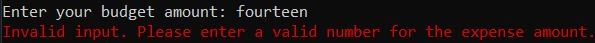

*Without errors:*
Ticking off checklist to proceed to the next function/method.

Example of successful input with no errors:
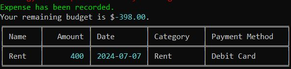

To finalize the project, it is required to compile and ensure application is executable with no errors.

Given the timeframe of the project, I had set the deadline to work around my schedule and ensure a final deadline.

***Below is the full check list and plan for my project.***

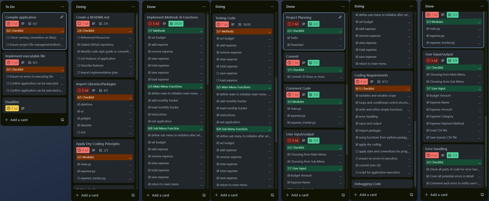

## System/Hardware Requirements

### Python Version
Python 3 is required to run the application due to potential compatibility issues with required python packages.

### Operating System
The Expense Tracker can be operated on all desktop operating systems such as:
- Windows
- macOS
- Linux

### Hardware System
The minimum hardware requirements to run this application as follows:

- Memory (RAM)- at least 2GB or more.
- Storage - at least 1GB

## Installation

1. Download and extract VanNguyen_T1A3.zip.
2. Open the terminal and navigate to the repository directory `cd VanNguyen_T1A3`.
3. Execute the bash script ./run.sh. Executing this file will perform the following:
    - Check if `Python 3` is installed. If Python 3 is not installed, the user will see an error message `"Python 3 is not installed. Please install Python 3 first."` and the script will end. If it is installed, it will continue to the next step.
    - Create a virtual environment if it does not exist `python3 -m venv venv`.
    - Activate the virtual environment `source venv/bin/activate`.
    - Install the required python packages from `requirements.txt`.
    - Change directory to the folder that contains the application `cd src`.
    - Run the main application `main.py`.
    - Deactivate the virtual environment when exiting.

## Modules

This application will contain 3 modules to run this application. This includes:

    - main.py
    - expense.py
    - expense_tracker.py

The expense.py stores the class Expense to contain attributes/values of stored data gained from user input/csv file.
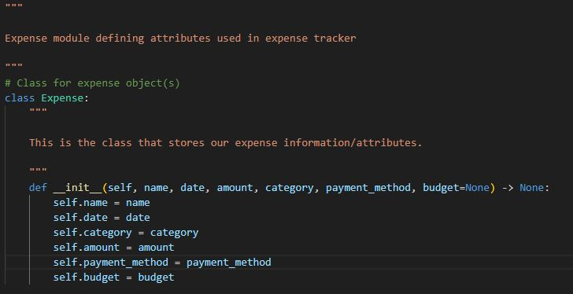

*More information on other modules below for their functions and methods.*

## Features

## Main Module

Contained in `main.py`, initializes application using an instance and displays users main menu and sub menu whilst pulling methods and attributes from `expense_tracker.py`.

This is executed with:

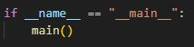

### Main Menu
Main menu will initialize once user starts up Expense Tracker Application.

    - Add new expense monthly tracker
    - Load expense monthly tracker
    - Instructions
    - Exiting Application

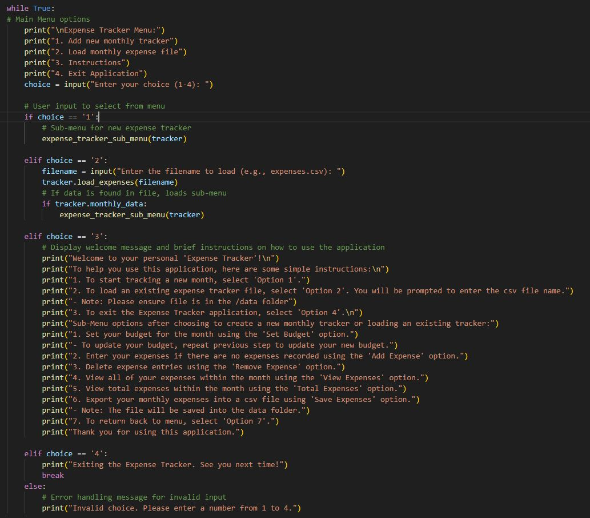

Using `while True:`, contains a loop to have user choose from the following option using if, elif and else statements. 
`if:` and `elif:` to create statement for each choice. e.g:

`if choice == '1':` is the first initial statement of choice. If chosen by user, it will direct them to the sub-menu function
`elif choice == '2':`is the follow up statement of choice. If chosen by user, prompts user to enter file name. If True, direct user to sub-menu. If False, will print error handling message from load_expense method `print(f"The file: {filename} cannot be found. Please enter the correct file name.")`.

If `else:`, it breaks the loop as False and exits the application.
By having `choice = input("Enter your choice (1-4): ")`, this is to ensure user input will only contain input from 1, 2, 3 or 4.
If user input is not 1, 2, 3 or 4, application will notify user of error message to input a valid option; `print("Invalid choice. Please enter a number from 1 to 4.")` and redirects users to the main menu.

#### Add New Expense Monthly Tracker
Directs user to the sub menu if user proceeds to create a new tracker

    - Loads 'Sub Menu'

#### Load Expense Monthly Tracker
Prompts user to enter a file name to open up an existing monthly tracker

    - User input file name with file extension (.csv). e.g. august_2024.csv
    - Loads 'Sub Menu' once file is loaded

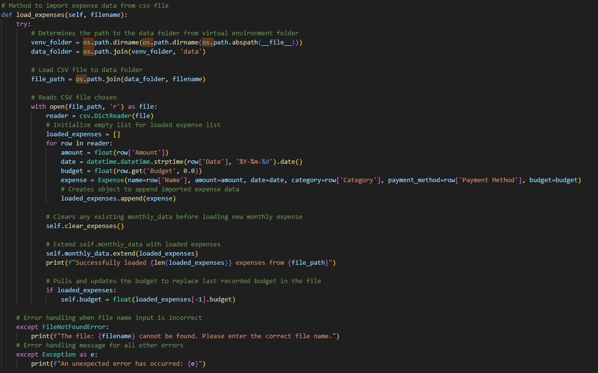

This will ensure application is pulling the file from the correct directory being `/data`. Once file is loaded, it will read the file using the following headers listed within the file itself to assign it's value to the `Expense class` attribute. Therefore, successfully loading the data for use in the application.

This is done by initializing an empty list called `loaded_expenses[]`, once values are loaded successfully, it will `append` value attributes into `Expense class` including the remaining budget as `self.budget`. To ensure no errors when importing data, values such as amount and budget is classified as a `float` whilst `datetime` is classified as a `string`.

***Successful Output***

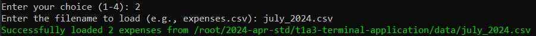

If user input is incorrect (such as incorrect file name or file path), it will display an error message and loop back to the main menu.

***Unsuccessful Output***

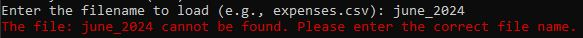

#### Instructions
Displays a list of basic instructions for the user to read and learn more about how each function of the application works.
    
    - Shows brief explanation for each method/function in the main menu and sub menu

***Output***

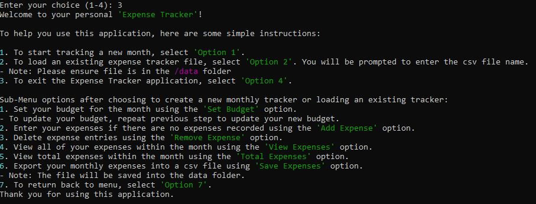

#### Exiting Application

    - Exits user from the application

### Sub Menu
Sub Menu will load and initialize after user has choosen 'Add new expense monthly tracker' or 'Load expense monthly tracker'
Once initialized, displays the sub menu to the user to select the following:

    - Set Budget
    - Add Expense
    - Remove an Expense
    - View Expenses
    - Total Expenses
    - Save/Export Expense File
    - Exit Application

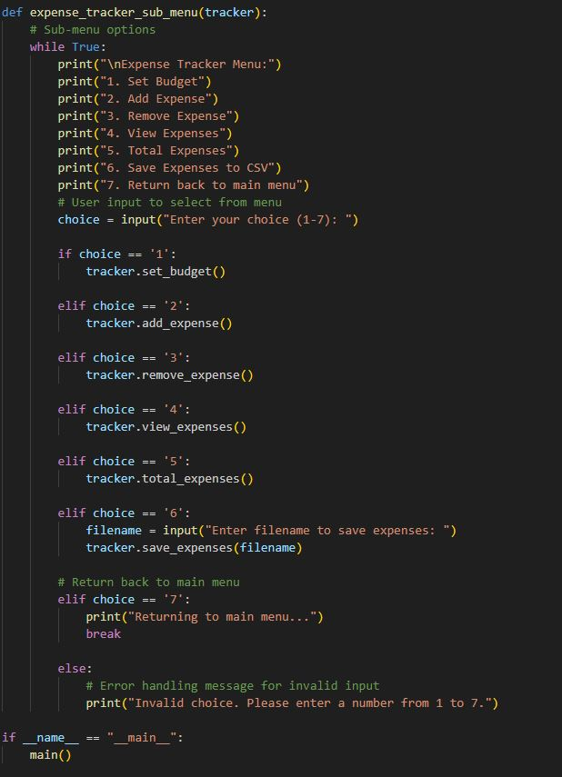

Using `while True:`, contains a loop to have user choose from the following option using if, elif and else statements. 
`if:` and `elif:` to create statement for each choice.
If `else:`, it breaks the loop as False and exits the application.
By having `choice = input("Enter your choice (1-7): ")`, this is to ensure user input will only contain input from 1, 2, 3, 4, 5, 6 or 7.
If user input is not 1, 2, 3, 4, 5, 6 or 7, application will notify user of error message to input a valid option; `print("Invalid choice. Please enter a number from 1 to 7.")` and redirects users to the main menu.

### Expense Tracker Module
Contained in `expense_tracker.py`, this is the class for the expense tracker module to define methods and inheriting attributes from the `class Expense` from `expense.py` module.

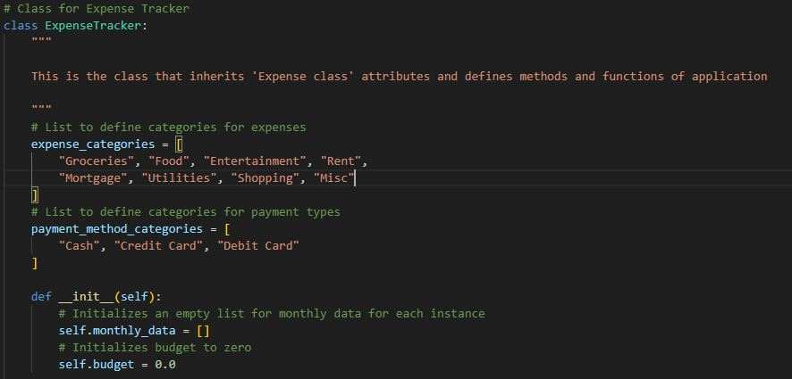

Within this class, it also stores attributes and information such as lists for expense type/category and payment methods, monthly data and sets budget attribute initial value to 0 if budget has not been set.

#### Set Budget
Prompts user to enter an amount to set their monthly budget.

    - Enter a budget amount
    - Displays budget amount set
    - Updates remaining budget [ if applicable for existing expenses ]

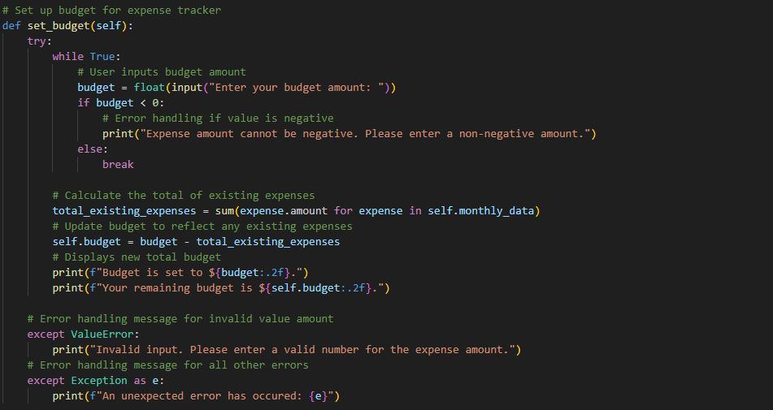

***Successful Output***

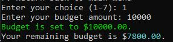

***Unsuccessful Output***

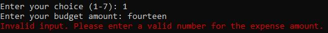
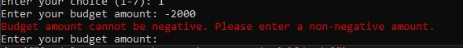

#### Add Expense
Prompts user to follow the prompts to enter the details of their expense:

    - Name of the expense
    - Amount of the expense
    - Date of the expense
    - Category of the expense
    - Payment Method

User input for expense name:
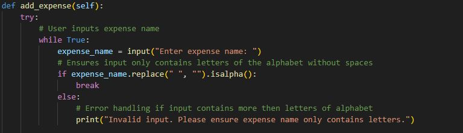

***Successful Output***

***Unsuccessful Output***
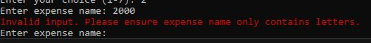

User input for expense amount:
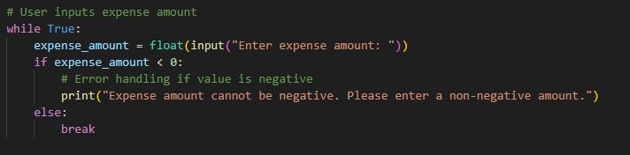

***Successful Output***

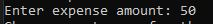

***Unsuccessful Output***

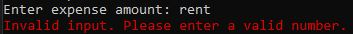
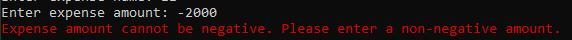

Expense date is automatically set depending on system's current clock time using `datetime` python package:
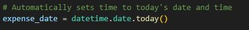

User input for choice from category list:
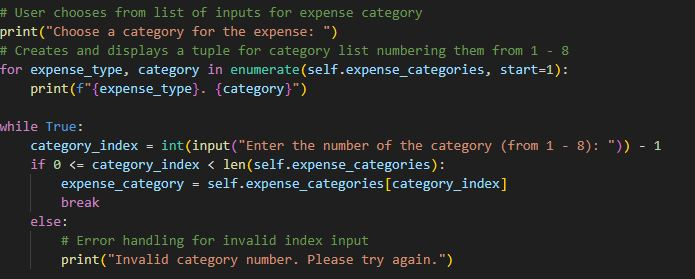

***Successful Output***

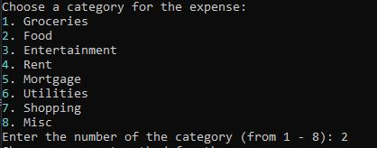

***Unsuccessful Output***

User input for choice from payment method list:
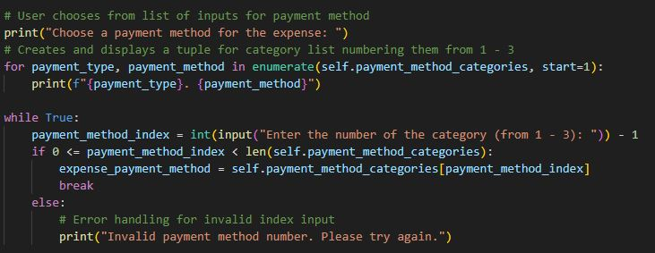

***Successful Output***

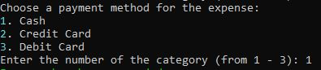

***Unsuccessful Output***

Displays results after user follows all prompts:
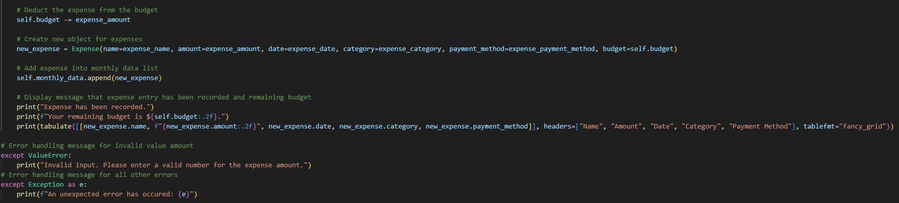

***Successful Output***

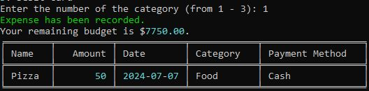

#### Remove an Expense
Shows user a list of existing expenses [ if applicable ]. Users will be able to choose from the following list to remove an expense, showing remaining expenses and remaining budget.

    - List all existing expenses
    - Choose from following expense list
    - Display remaining expenses and updated remaining budget

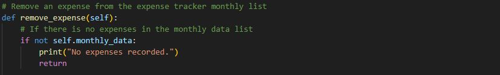
***Output***
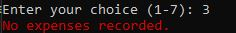

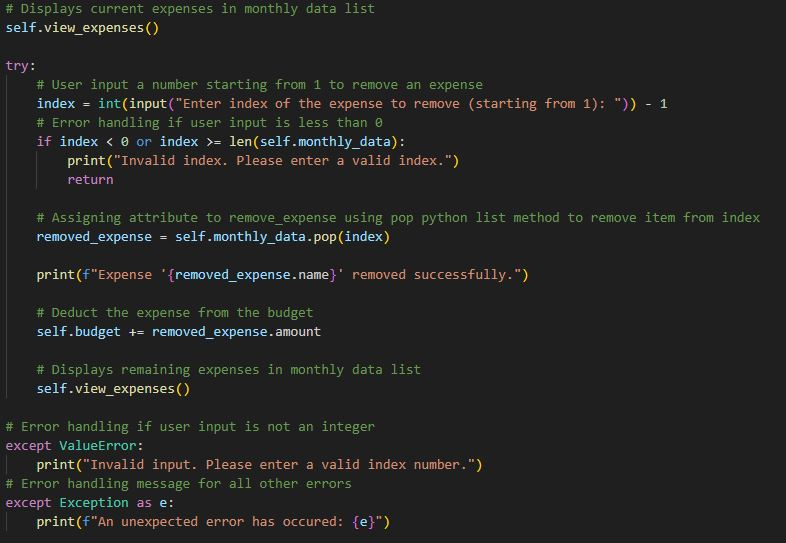
***Successful Output***

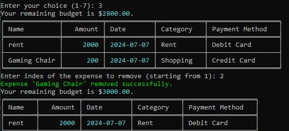

***Unsuccessful Output***

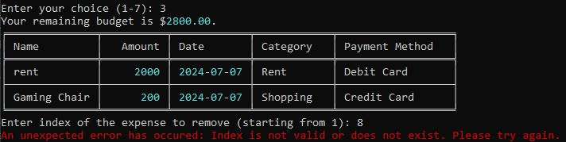

#### View Expenses
Displays all expenses that has been recorded within the current monthly tracker loaded

    - view expense by month
        - allows users to select an entry by month
        - displays budget, remaining budget and expenses for the month
    - view expense by category
        - allows users to select an entry by category
        - displays budget, remaining budget and expenses for the selected category

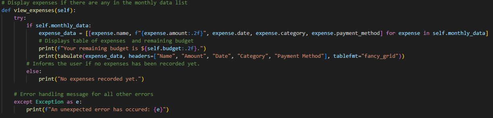

***Successful Output***

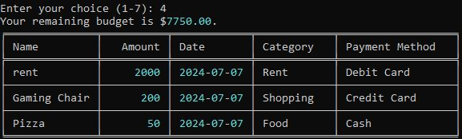

***Unsuccessful Output***

### Total Expenses
Displays the sum and total of all expenses within the current monthly tracker loaded

    - Display total amount in $ of expenses

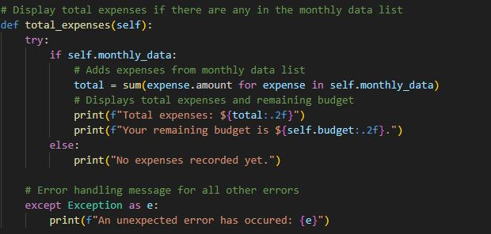

***Successful Output***

***Unsuccessful Output***

### Export expense file
Prompts user to save and name the file for their monthly tracker csv file

    - Allows user to export expense data to .csv file
    - User input file name without file extention. e.g. august_2024
    - Files are saved within application 'data' folder
    - Contains data of expense entries for month exported.

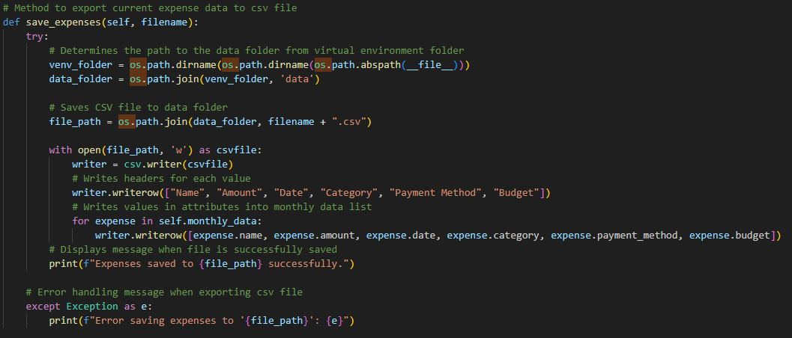

***Successful Output***

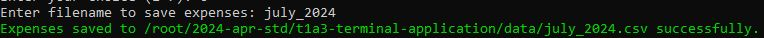

### Exit Application

    - Directs users to return to main menu

## References

- https://peps.python.org/pep-0008/
- https://www.w3schools.io/file/python-csv-read-write/
- https://www.geeksforgeeks.org/os-path-module-python/?ref=lbp
- https://pypi.org/project/pyfiglet/
- https://pypi.org/project/tabulate/
- https://github.com/Textualize/rich
- https://rich.readthedocs.io/en/stable/appendix/colors.html