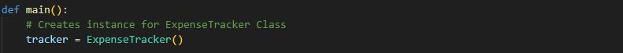
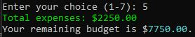

# Expense Tracker

## GitHub Repository
https://github.com/montsieur/t1a3-terminal-application

## Python Packages/Libraries

- `csv` - implements the function to read and write data into a `.csv` file
- `datetime` - allows application to automaically read your system's date and time
- `os` - implements the function on the application to handle basic system operation such as file handling
- `tabulate` - allows data to be organized in a table
- `rich` - a python package that can implement different styles such as color, emojis, styled fonts and more
- `pyfigulate` - converts text into ASCII art fonts

## Coding style guide

I will be using `PEP 8 Python` guidelines to write and code my Expense Tracker application.

## Project Planning

### Trello
To plan for my project, I used Trello to create a check list ensuring the project meets all requirements of the assessment rubric.

My initial step was to implement the planning stage of the project before laying out the basic foundation on the application code for each module containing it's function and/or method. After laying out the foundation, I expanded each method and function one by one to ensure each function/method is functional with and without errors.

*With errors:*
I am able to determine the errors that will occur and expand specifically for those errors with the use of error handling. Once error has been determined, debugging process will proceed.

Example of  error handling:

*Without errors:*
Ticking off checklist to proceed to the next function/method.

Example of successful input with no errors:

To finalize the project, it is required to compile and ensure application is executable with no errors.

Given the timeframe of the project, I had set the deadline to work around my schedule and ensure a final deadline.

***Below is the full check list and plan for my project.***

## System/Hardware Requirements

### Python Version
Python 3 is required to run the application due to potential compatibility issues with required python packages.

### Operating System
The Expense Tracker can be operated on all desktop operating systems such as:
- Windows
- macOS
- Linux

### Hardware System
The minimum hardware requirements to run this application as follows:

- Memory (RAM)- at least 2GB or more.
- Storage - at least 1GB

## Installation

1. Download and extract VanNguyen_T1A3.zip.
2. Open the terminal and navigate to the repository directory `cd VanNguyen_T1A3`.
3. Execute the bash script ./run.sh. Executing this file will perform the following:
    - Check if `Python 3` is installed. If Python 3 is not installed, the user will see an error message `"Python 3 is not installed. Please install Python 3 first."` and the script will end. If it is installed, it will continue to the next step.
    - Create a virtual environment if it does not exist `python3 -m venv venv`.
    - Activate the virtual environment `source venv/bin/activate`.
    - Install the required python packages from `requirements.txt`.
    - Change directory to the folder that contains the application `cd src`.
    - Run the main application `main.py`.
    - Deactivate the virtual environment when exiting.

## Modules

This application will contain 3 modules to run this application. This includes:

    - main.py
    - expense.py
    - expense_tracker.py

### Main Module

Contained in `main.py`, initializes application using an instance and displays users main menu and sub menu whilst pulling methods and attributes from `expense_tracker.py`.

This is executed with:

### Expense Module

The expense.py stores the class Expense to contain attributes/values of stored data gained from user input/csv file.

### Expense Tracker Module
Contained in `expense_tracker.py`, this is the class for the expense tracker module to define methods and inheriting attributes from the `class Expense` from `expense.py` module.

Within this class, it also stores attributes and information such as lists for expense type/category and payment methods, monthly data and sets budget attribute initial value to 0 if budget has not been set.

*More information on other modules below for their functions and methods.*

## Features

### Main Menu
Main menu will initialize once user starts up Expense Tracker Application after following the instructions above. 
Once the main menu has loaded, you will be able to choose from one of the four options:

    - Add new expense monthly tracker
    - Load expense monthly tracker
    - Instructions
    - Exiting Application

***Output***

If a user chooses an option that is not between 1 and 4, an error would appear notifying you to select the correct option using the preferred index number instructed as shown below.

***Unsuccessful Output***

After the error shown, you'll be redirected back to the main menu to choose from the following options again. When you have selected one of the following options from 1 to 3, it will prompt you to the next available step (*more information below each step*).

Otherwise, if the user chooses `Option 4. Exit Application`, the program will be closed and the virtual environment that was activated will be deactivated.

***code breakdown***

Using `while True:`, contains a loop to have user choose from the following option using if, elif and else statements. 
`if:` and `elif:` to create statement for each choice. e.g:

`if choice == '1':` is the first initial statement of choice. If chosen by user, it will direct them to the sub-menu function
`elif choice == '2':`is the follow up statement of choice. If chosen by user, prompts user to enter file name. If True, direct user to sub-menu. If False, will print error handling message from load_expense method `print(f"The file: {filename} cannot be found. Please enter the correct file name.")`.

If `else:`, it breaks the loop as False and exits the application.
By having `choice = input("Enter your choice (1-4): ")`, this is to ensure user input will only contain input from 1, 2, 3 or 4.
If user input is not 1, 2, 3 or 4, application will notify user of error message to input a valid option; `print("Invalid choice. Please enter a number from 1 to 4.")` and redirects users to the main menu.

#### Add New Expense Monthly Tracker
By selecting `Option 1. Add new monthly expense`, it directs user to the sub menu if user proceeds to create a new tracker. (*Further information about Sub-Menu is below.*)

    - Loads 'Sub Menu'

#### Load Expense Monthly Tracker
By selecting `Option 2. Load Expenses`, user is prompted to enter a file name to open up an existing monthly tracker

    - User input file name with file extension (.csv). e.g. august_2024.csv
    - Loads 'Sub Menu' once file is loaded

When you input a valid file name into the prompt, you will be redirected to the Sub-Menu where you may choose to further manage your expenses.

***Successful Output***

If user input is incorrect (such as incorrect file name or file path), it will display an error message and loop back to the main menu.

***Unsuccessful Output***

After the error shown, you'll be redirected back to the main menu to choose from the following options again. 
You may select the option to `Option 2. Load Expenses` again and input a valid file name to proceed to the next step within the sub-menu.

Otherwise, if the user chooses `Option 4. Exit Application`, the program will be closed and the virtual environment that was activated will be deactivated.

***code breakdown***

This will ensure application is pulling the file from the correct directory being `/data`. Once file is loaded, it will read the file using the following headers listed within the file itself to assign it's value to the `Expense class` attribute. Therefore, successfully loading the data for use in the application.

This is done by initializing an empty list called `loaded_expenses[]`, once values are loaded successfully, it will `append` value attributes into `Expense class` including the remaining budget as `self.budget`. To ensure no errors when importing data, values such as amount and budget is classified as a `float` whilst `datetime` is classified as a `string`.

#### Instructions
By selecting `Option 3. View Instructions`, it will display a list of basic instructions for the you to read and learn more about how each function of the application works.
    
    - Shows brief explanation for each method/function in the main menu and sub menu

***Output***

Once instructions have been displayed, it will redirect you to the main menu to wait for your next input if you decide to add new expense tracker, load tracker or exit the application.

#### Exiting Application
By selecting `Option 4. Exit Application`, you will close the application and disabling the virtual environment that was activated through the executable file.

    - Exits user from the application

### Sub Menu
Sub Menu will load and initialize after user has choosen `Add new expense monthly tracker` or `Load Expense` monthly tracker'
Once initialized, displays the sub menu to the user to select the following:

    - Set Budget
    - Add Expense
    - Remove an Expense
    - View Expenses
    - Total Expenses
    - Save/Export Expense File
    - Exit Application

***Output***

Similarly to the main menu, If a user chooses an option that is not between 1 and 7, an error would appear notifying you to select the correct option using the preferred index number instructed as shown below.

***Unsuccessful Output***

After the error shown, you'll be redirected back to the `sub-menu` to choose from the following options again. When you have selected one of the following options from 1 to 6, it will prompt you to the next available step (*more information below each step*).

Otherwise, if the user chooses `Option 7. Return back to main menu`, the program will be closed and the virtual environment that was activated will be deactivated.

***code breakdown***

Using `while True:`, contains a loop to have user choose from the following option using if, elif and else statements. 
`if:` and `elif:` to create statement for each choice.
If `else:`, it breaks the loop as `False`, it will return back to the `main menu`
By having `choice = input("Enter your choice (1-7): ")`, this is to ensure user input will only contain input from 1, 2, 3, 4, 5, 6 or 7.
If user input is not 1, 2, 3, 4, 5, 6 or 7, application will notify user of error message to input a valid option; `print("Invalid choice. Please enter a number from 1 to 7.")` and redirects users to the main menu.

#### Set Budget
By selecting `Option 1. Set Budget`, this will prompt you to enter an amount to set your budget for the month.

    - Enter a budget amount
    - Displays budget amount set
    - Updates remaining budget [ if applicable for existing expenses ]

Once you have successfully entered a valid amount, you will be notified that the budget has been successfully set and recorded for your expense tracker. This will be displayed including your remaining budget if there is any existing expenses for those monthly tracker that has been loaded. 

You'll be redirected back to the sub-menu if you wish to manage your expenses further.

***Successful Output***

If you did not enter an amount that is not a number, include other characters that is not a number or entered a negative value, you will be notified an error shown below:

***Unsuccessful Output***

*When user input is invalid:*

When this error appears, this will redirect you back to the sub-menu. To try again, re-select `Option 1. Set Budget`.

*When user input is a negative number:*

When this error appears, the application will prompt you to enter the amount again until amount is valid.

***code breakdown***

When option is selected, `while True:` it will wait for user's input.
`budget < 0` will prevent users to store a negative value for the budget
`self.budget` object will inherit the new value of `budget` (user input) minus total expenses to equal to remaining balance
`total expenses` is calculated if there is any value attributes stored in `self.monthly_data` which is inherited by `class Expense`. 

#### Add Expense
By selecting `Option 2. Add Expense`, this will have you follow a number of prompts to enter the details of your expense:

    - Name of the expense
    - Amount of the expense
    - Date of the expense
    - Category of the expense
    - Payment Method

***User input for expense name:***
Once you have entered a valid name of your expense into the application, it will proceed to the next step to enter the expense amount.

***Successful Output***

If you have entered an invalid name which contains values not part of the alphabet, it will display an error prompting you to enter a valid expense name and ensure that your expense name must contain letters only.

***Unsuccessful Output***

***code breakdown***

***User input for expense amount:***
Once you have entered a valid amount of your expense into the application, it will proceed to the next step to enter the expense category.

***Successful Output***

***Unsuccessful Output***
If you have entered an invalid value amount or a negative amount, an error will be displayed on your screen as shown below:

*When user input is invalid:*

When this error appears, this will redirect you back to the sub-menu. To try again, re-select `Option 2. Add Expense`.

*When user input is a negative number:*

When this error appears, the application will prompt you to enter the amount again until amount is valid.

***code breakdown***

**NOTE**: *Expense date is automatically set depending on system's current clock time using `datetime` python package:*

***code breakdown***

Allows user to avoid inputting wrong date and time and will automatically set the date and time for the user.

***User input for choice from category list:***
Choose from the folllowing options below when prompted to choose the type of expense. Once you have chosen a valid category, it will proceed to the last step.

***Successful Output***

If you enter an invalid number that is not from the following options, an error will be displayed and you will be prompted to enter the correct valid number from the following options until successful.

***Unsuccessful Output***

***code breakdown***

By pulling up the `category list` from the `class ExpenseTracker` attributes under `expense_catergories`, we are able to set an index per category to allow the user to choose from 1 - 7. To prevent the index to start at 0, we input `-1` to the index, so when user input is `1`, it will read the first option being `0`.

***User input for choice from payment method list:***
Similar to the expense category list, this will allow you to choose from the following 3 options for your payment method used to pay for your expense.

***Successful Output***

If you enter an invalid number that is not from the following options, an error will be displayed and you will be prompted to enter the correct valid number from the following options until successful.

***Unsuccessful Output***

***code breakdown***

Similar concept to expense category, but pulls a list from the `class ExpenseTracker` under `payment_method_catergories`.

***Displays results after user follows all prompts:***

If you have followed all the prompts successfully, the application will display that your expense has been recorded whilst displaying the remaining budget and breakdown of your expense that you have entered. You will be then redirected back to the sub-menu if you wish to further manage your expenses or return back to main menu.

***Successful Output***

***code breakdown***

Remaining budget is calculated from the `self.budget` minus the new value of the `expense amount` (total).
All of the data from the user will then be append to the `monthly_data` list ready to export using the `save_expense` method.
Using `tabulate`, we are able to gather the value input from the user that the Expense attributes have been stored to, to stylized and organize data to a table.

#### Remove an Expense
By selecting `Option 3. Remove Expense`, this will display any existing expenses and allow you to remove them and update your expense tracker.

    - List all existing expenses
    - Choose from following expense list
    - Display remaining expenses and updated remaining budget

Although, if there are no existing expenses recorded, an error will be displayed showing that there is no expenses recorded. Please add an expense before using this option.

***Output***

Once you select a valid index to remove your expense (starting from 1), the application will notify you that you have successfully removed the expense and display the updated remaining budget and list of remaining expenses in your monthly tracker.

***Successful Output***

If you do not enter a valid number index, you will be prompted an error advising you did not select a correct index to remove the expenses.

***Unsuccessful Output***

You will then be redirected back to the sub-menu for you to either try again or add a new expense if you do not have any existing expenses in your monthly tracker.

***code breakdown***

Ensuring user input is valid, we defined the input as an integer only using `int` allowing whole numbers.
By using .pop, it will remove the expense from the `self.monthly_data` list.

#### View Expenses
By selecting `Option 4. View Exenses`, it will display all expenses that has been recorded within the current monthly tracker loaded including the remaining budget.

    - view expense by month
        - allows users to select an entry by month
        - displays budget, remaining budget and expenses for the month
    - view expense by category
        - allows users to select an entry by category
        - displays budget, remaining budget and expenses for the selected category

***Successful Output***

Although, if there are no existing expenses recorded, an error will be displayed showing that there is no expenses recorded. Please add an expense before using this option.

***Unsuccessful Output***

After displaying either expense or error, you will be redirected to the sub-menu to further manage your expenses or please add a new expense if no expenses have been recorded.

***code breakdown***

Expenses are pulled using an object as an instance to the value attributes stored within the `self.monthly_data` list. 
Similar to the `add_expense`, it uses `tabulate` to organize data into a stylized table for the user.

### Total Expenses
By selecting `Option 5. Total Budget` will display the sum and total of all expenses within the current monthly tracker loaded including the remaining budget.

    - Display total amount in $ of expenses

***Successful Output***

Although, if there are no existing expenses recorded, an error will be displayed showing that there is no expenses recorded. Please add an expense before using this option.

***Unsuccessful Output***

After displaying either expense or error, you will be redirected to the sub-menu to further manage your expenses or please add a new expense if no expenses have been recorded.

***code breakdown***

This is done by grabbing the attribute values from `amount` for `class Expense` in `self.monthly_data` list and totalling the amounts using `sum`.

### Export expense file
By selecting `Option 6. Save Expense`, this will prompt you to enter a file name that you wish to name their current monthly tracker that you are currently managing in the application.

    - Allows user to export expense data to .csv file
    - User input file name without file extention. e.g. august_2024
    - Files are saved within application 'data' folder
    - Contains data of expense entries for month exported.

***Successful Output***

After entering a valid file name, you will be redirected to the sub-menu to further manage your expenses or you may return back to the main menu for further options.

*For any unexpected errors, this will be displayed on your screen and you will be redirected to the sub-menu to select an option from the menu.*

***code breakdown***

Similar to the `load_expense` method but this method allows users to `write` information and data and save it to a `csv` file.

### Back to main menu
By selecting `Option 7. Return back to main menu`, this will redirect you back to the main menu if you wish to add new expense monthly tracker, load existing monthly tracker, view instructions again for further clarity or exit the application.

    - Directs users to return to main menu

## That is all!

Thank you for using my 'Expense Tracker' application! For further information about the application, please feel free to contact me on `GitHub`.

## References

- https://peps.python.org/pep-0008/
- https://www.w3schools.io/file/python-csv-read-write/
- https://www.geeksforgeeks.org/os-path-module-python/?ref=lbp
- https://pypi.org/project/pyfiglet/
- https://pypi.org/project/tabulate/
- https://github.com/Textualize/rich
- https://rich.readthedocs.io/en/stable/appendix/colors.html